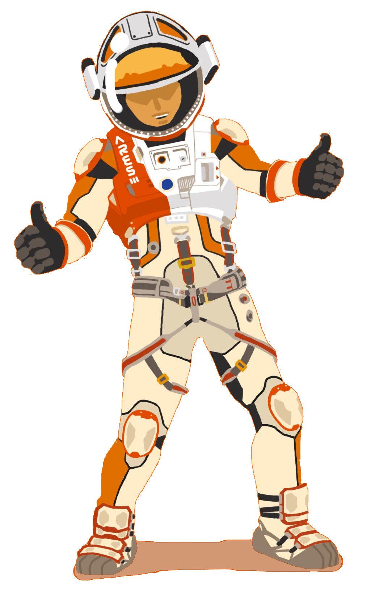
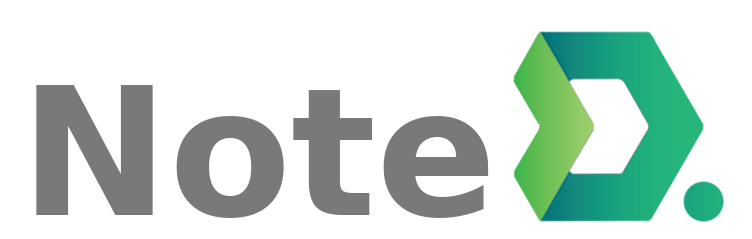

<!-- 

 -->

<h2 align="center">
  Hi , I'm Pavel
</h2>

<!-- 

-->

<h3 align="center">A curious backend developer based in Saint-Petersburg</h3>

I'm a passionate developer with a **higher education in computer science**. I'm currently **seeking challenging career opportunities**. I have a strong mastery of **Python, Django** and mostly work in a **Linux** environment. Proficient in creating visually appealing and user-friendly frontend using **HTML, CSS, JavaScript, and Bootstrap**.

For a detailed overview of my coding skills and abilities, please visit my current project - [NoteD](https://welel-noted.site/en/), [on GitHub](https://github.com/welel/noted). This project showcases my technical expertise and attention to detail, and will give you a clear understanding of the quality of work I am capable of delivering.

<h4 align="center">🔍 looking for a job &nbsp; | &nbsp; 🌱 building  &nbsp; | &nbsp; 💬 contact me </h4>

👔 **Hire me**: If you are looking for a hardworking and dedicated developer, please do not hesitate to reach out to me for an interview or to discuss a test task.

:envelope: **Contacts**: Telegram [@weleldev](https://t.me/weleldev) | pavel.loginov.dev@gmail.com.

 

## 🛠️ Tech Stack

Main|         
-|:-
 Have experienced|             
Tools|       

 

## 💡 Current Project

[NoteD](https://github.com/welel/noted) is a platform designed for creating and sharing personal notes, allowing users to search for relevant topics, save, download and follow notes from other users. The platform also enables users to search for notes on specific sources of information such as books, articles, videos, lectures and other types of content. The project was developed with the primary goals of providing an opportunity for me to learn and improve my skills while creating it, as well as a showcase for recruiters to demonstrate my coding abilities.

 

## 😎 Some Things About Me
* 📱 Believe that spending less time on social networks can make us happier.
* 🚀 Exist somewhere on [Codewars](https://www.codewars.com/users/-welel-), [Stepik](https://stepik.org/users/45294126).
* 📓 Get knowledge on [Stepik](https://stepik.org/), [Real Python](https://realpython.com/), [Very Academy](https://www.youtube.com/channel/UC1mxuk7tuQT2D0qTMgKji3w), [Yandex Academy](https://www.youtube.com/c/%D0%90%D0%BA%D0%B0%D0%B4%D0%B5%D0%BC%D0%B8%D1%8F%D0%AF%D0%BD%D0%B4%D0%B5%D0%BA%D1%81%D0%B0/about) besides books and docs.
* 🏃 Really love running.
* 📚 Books have impacted me: "Trilogy of Desire" (T.D.), "Sapiens: A Brief History of Humankind" (Y.N.H.), "The Power of Now" (E.T.)

