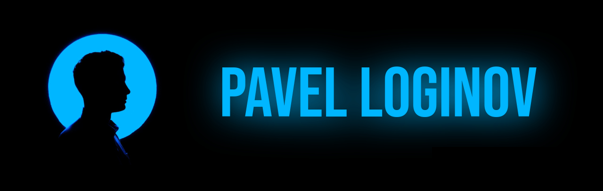

<h2 align="center">Glad to see you here </h2>
<h3 align="center">I am a backend developer and a curious person based in Russia.</h3>
My name is **Pavel**. I am a passionate developer, who is learning and trying to improve everyday. I have a **higher education in Computer Science**, currently **looking for a job**. I **create educational projects for web** and learn different aspects of web development.

<h4 align="center">💻 looking for a job  |  🛠️ building   |  💬 contact me [@contact]()</h4>

I am well versed in **Python, Django** and working in a **Linux** environment. I can create simple fronted with **HTML**, **CSS**, **JS** and **Bootstrap**. I have spent the last year serving in the army and now I'm focusing on recovery expertise and knowledge in Computer Science.

Apart from what I have already mentioned, I am a curious person, interested in many aspects of life and things such as physical, mental, social aspects, investing, art, productivity, camping and so on.

<!-- DESTRACTIVE SOCIAL MEDIA -->